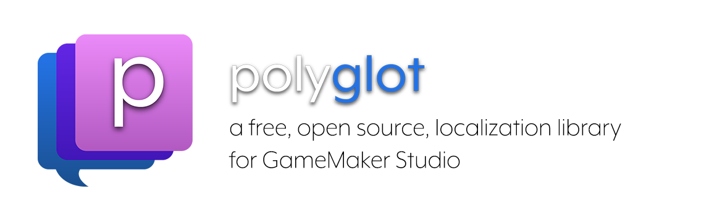

# polyglot


Polyglot is a library for modern GameMaker Studio projects for loading localized strings easily and efficiently.

#### Table of Contents
* [Setup](#setup)
* [Usage](#usage)
* [Licensing](#licensing)
* [Attribution](#attribution)

## Setup

Integrating Polyglot into your project is simple: just [download the latest release](https://github.com/daikon-games/polyglot/releases), and then in GameMaker Studio click on the **Tools** menu and select **Import Local Package**. Choose the `.yymps` file you downloaded, and import all assets.

Alternatively you can install polyglot from the [Game Maker Marketplace](https://marketplace.yoyogames.com/assets/10472/polyglot).

If your game will use a locale named `en` (used for English language by default) then absolutely no configuration is required! If not, you will just need to drop an instance of `obj_polyglot` into a room in your game somewhere and change the variable `defaultLocale` to one that you plan to use.

You will need to create `.json` files in a directory called `i18n` in your game's "Included Files" directory. Each `.json` file will contain all of the strings for a given locale.

For instance, create `your-project/datafiles/i18n/en.json` to store all of your strings for the English locale.

## Usage

Polyglot exposes the following functions for you to use:

```
str(stringKey, [data])
obj_polyglot.setLocale(locale)
obj_polyglot.getLocale()
```

Note that `str` is not a method of `obj_polyglot` but rather provided by the script file `scr_polyglot` for more convenience.

Let's quickly discuss each:

### str

This method will return the localized value of a string from the current locale. Since your locale file is in json format, it can contain a nested structure for easier organization.

Let's say we wanted to store a string called "hello" under a section called "dialog", with the value "Hello there!". The `.json` contents would look like this:
```
{
    "dialog": {
        "hello": "Hello there!"
    }
}
```
Then to get this localized string in our game we can invoke Polyglot like so:
```
var localStr = str("dialog.hello");
```

Simply use `str` any time you would previously have hard-coded a string.

#### Interpolation and Pluralization

`str` has a few more tricks up its sleeve. Firstly, it can replace specific markers in your localization string with variable data. This can be really useful for lots of reasons, for this example let's say that we have a variable in our game called `pName` that contain's the player's name (and let's say that is set to "Nick" as an example), and that our dialog string looks like this.

```
{
    "dialog": {
        "hello": "Hello there {name}, how are you?"
    }
}
```
If we call `str` with the optional second parameter, like so:
```
str("dialog.hello", {name: pName})
```
Then it will return
```
Hello there Nick, how are you?
```
I'm sure you can see how powerful this could be. Additionally, we can use this feature to specify multiple pluralizations of a string that involves a numeric aspect.

In a simple case, let's imagine a simple point counter. We want the word `point` to be singular when there is 1 point, but plural (`points`) otherwise. In our language file we could define the strings like this:

```
{
    "score__one": "{count} point",
    "score__plural": "{count} points"
}
```
Then we can call `str`
```
str("score", {count: currScore})
```
Note that we only include `score` as the string key. polyglot will automatically pick the key with `__one` or `__plural` (that's two underscores) based on the value of `count` in the data struct. To invoke this automatic pluralization the data struct must always contain a field called `count`, even if the localized strings don't use it. You can also specify a `__zero` version of your string if you want special wording for when there are none of something. Here is an example that includes a zero:
```
{
    "failures__zero": "Perfect run so far!",
    "failures__one": "One little mistake...",
    "failures_plural": "You have failed {count} times"
}
```

### setLocale

This method's purpose is to change the current locale. Polyglot doesn't have any hard requirements for the names of the locales,
just that they must be strings, and that the `.json` files you create must have the exact names of the locale you set Polyglot to use.

To change the locale, simple call `setLocale` like so:
```
obj_polyglot.setLocale("es");
```

### getLocale

polyglot also includes a method for fetching the currently set locale.
```
obj_polyglot.getLocale()
```
Which would return the string `en`, or `es`, or whatever the locale is currently set to.

## Licensing

Polyglot is licensed under Creative Commons BY 4.0. Essentially, you may use it, change it, ship it, and share it, with attribution.
Just make sure to somewhere mention the use of **Polyglot by Daikon Games**!
